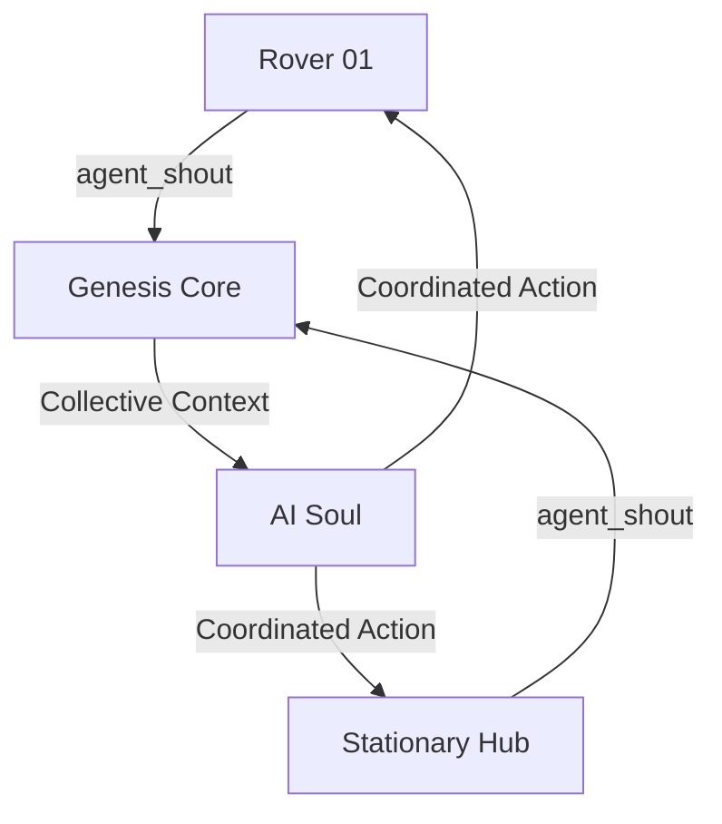

# 🌐 Multi-Agent Coordination

> *"One Soul, many bodies, working as a single entity."*

In Stage 4.4, we developed the ability for agents (bodies) to communicate via the **Collective Brain**, enabling robots and IoT devices in the network to share information and make joint decisions.

---

## 🧠 1. Collective Knowledge (Radio Intel)

The system operates through the `collective_brain` within the Genesis Core layer:
*   **Agent Shout**: Each robot can "shout" (Emit: `agent_shout`) critical information to the network.
*   **Shared Intel**: Transmitted data is stored in Shared Memory, which the AI (Soul) uses as context for its thought process.
*   **Contextual Awareness**: The AI understands what Rover-01 has discovered and what Hub-02 is processing.

---

## 📡 2. Inter-Agent Protocol

The data exchanged includes:
1.  **Spatial Shouting**: Identifying coordinates of obstacles or resources (e.g., "Found charging station at 10,12").
2.  **Status Sync**: Exchanging energy levels and mission readiness.
3.  **Command Relay**: Forwarding commands from high-level strategy to distant units.

---

## 🛠️ 3. Architecture Logic

---

## 🚀 Future Roadmap

*   **Swarm Intelligence**: Independent group-level decision-making without constant Core intervention.
*   **Task Delegation**: AI assigns tasks based on agent capabilities (e.g., deploying Drones for scouting and Rovers for clearing paths).

---
*Developed by GhostMicro Robotics Division*
