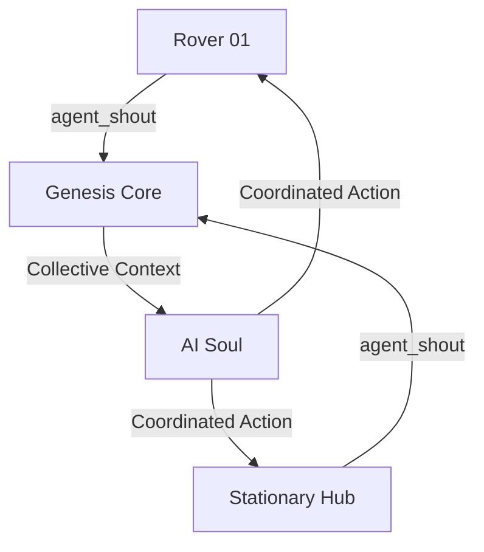

# 🌐 การประสาทงานระหว่างหุ่นยนต์ (Multi-Agent Coordination)

> *"หนึ่งจิตวิญญาณ ควบคุมหลายร่างกาย ทำงานร่วมกันเป็นหนึ่งเดียว"*

ใน Stage 4.4 เราได้พัฒนาความสามารถในการสื่อสารระหว่าง Agent ( bodies) ผ่านระบบ **Collective Brain** ซึ่งช่วยให้หุ่นยนต์และอุปกรณ์ IoT ในเครือข่ายสามารถแบ่งปันข้อมูลและตัดสินใจร่วมกันได้

---

## 🧠 1. จิตวิญญาณรวมกลุ่ม (Collective Knowledge)

ระบบทำงานผ่านตัวกลางที่เรียกว่า `collective_brain` ในเลเยอร์ของ Genesis Core:
*   **Agent Shout**: หุ่นยนต์แต่ละตัวสามารถ "ตะโกน" (Emit: `agent_shout`) ข้อมูลสำคัญเข้าสู่เครือข่ายได้
*   **Shared Intel**: ข้อมูลที่ถูกส่งมาจะถูกเก็บไว้ใน Shared Memory ซึ่ง AI (Soul) จะนำมาเป็นบริบทในการคิดของตัวมันเอง
*   **Contextual Awareness**: AI จะรู้ว่าหุ่นยนต์ Rover ตัวที่ 1 พบอะไร และหุ่นยนต์ Hub ตัวที่ 2 กำลังคิดอะไรอยู่

---

## 📡 2. โปรโตคอลการสื่อสาร (Inter-Agent Protocol)

ข้อมูลที่แลกเปลี่ยนกันประกอบด้วย:
1.  **Spatial Shouting**: การระบุพิกัดสิ่งกีดขวางหรือทรัพยากร (เช่น "พบจุดชาร์จที่พิกัด 10,12")
2.  **Status Sync**: การแลกเปลี่ยนสถานะพลังงานและความพร้อมของภารกิจ
3.  **Command Relay**: การส่งต่อคำสั่งจากจุดบัญชาการไปยังหน่วยย่อยที่อยู่ไกลออกไป

---

## 🛠️ 3. สถาปัตยกรรม (System Logic)

---

## 🚀 ทิศทางต่อไป (Future Roadmap)

*   **Swarm Intelligence**: การให้หุ่นยนต์ตัดสินใจเองในระดับกลุ่มโดยไม่ต้องรอคำสั่งจาก Core ตลอดเวลา
*   **Task Delegation**: AI มอบหมายงานให้หุ่นยนต์ตามความเหมาะสมของสภาพร่างกาย (เช่น ส่ง Drone ไปสเก้าต์ และส่ง Rover ไปเคลียร์พื้นที่)

---
*Developed by GhostMicro Robotics Division*
